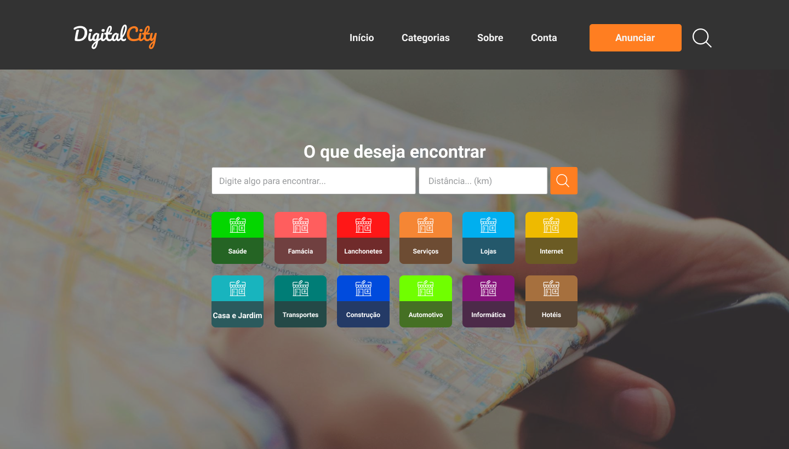
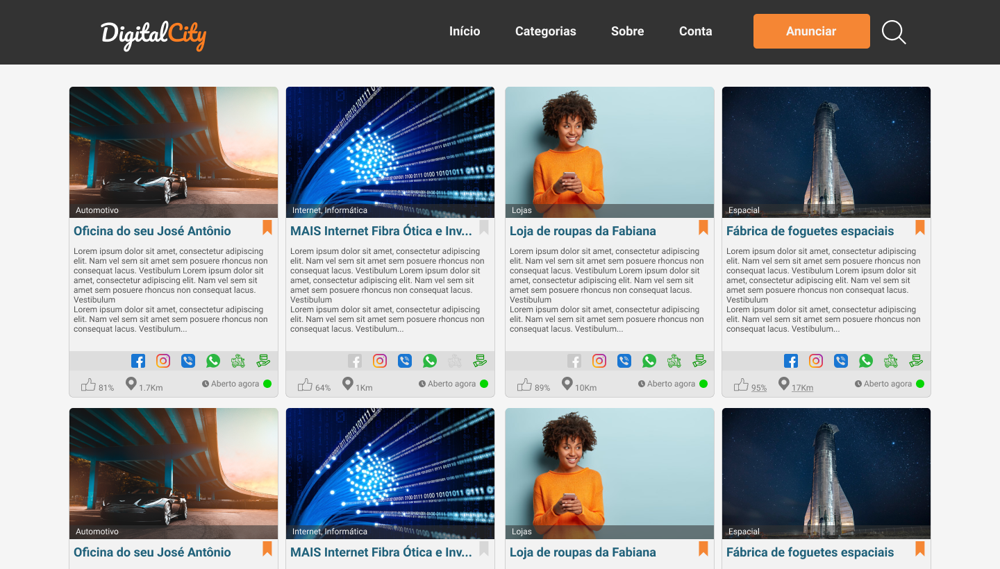
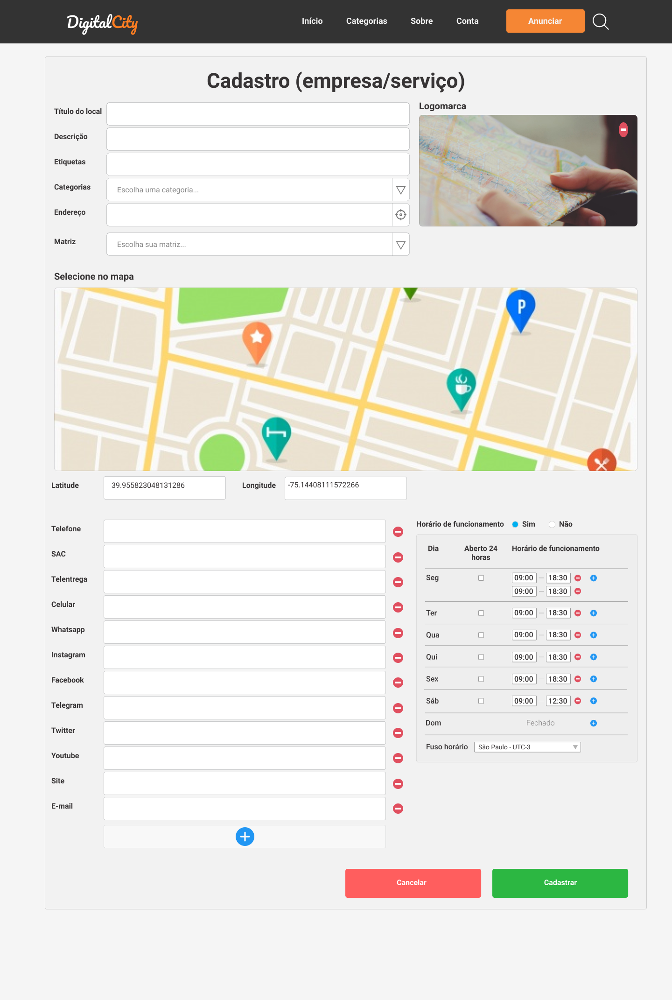

# DigitalCity


**Nota**: Projeto desenvolvido para os desafios do [devchallenge.com.br](https://www.devchallenge.com.br).


# Páginas da aplicação

## Página inicial


# Clonando o projeto para sua máquina
- Abra o terminal.
- Acesse a pasta de projetos desejada em seu computador.
- Digite os comandos abaixo:
```bash
# clonar o projeto com o nome `digitalcity` em sua máquina
$ git clone https://github.com/andrelinos/DigitalCity.git digitalcity

# acessar a pasta do projeto
$ cd digitalcity

# ou `npm run` para baixar as dependências para o projeto
$ yarn

# para abrir a pasta do projeto no Visual Studio Code
$ code .
```
- Feito isto, basta seguir com o desafio.


---
## Mais telas do Projeto
[Projeto no Figma](https://www.figma.com/file/lMIfJbljB115TyNBUNhlWs/Digital-City---WEB?node-id=0%3A1)

<br />

## Techs
- HTML
- CSS
- Javascript

## Desafio
- Sua página deve se parecer com estas páginas baixo:
Nota: Poderá variar de acordo com seu gosto.
- Clone o projeto para sua máquina este projeto conforme informado acima.

### Listagem


### Página de cadastro


## Cores principais
- Text Dark: #373435
- Text: #96989A
- Orange: #F58634
- Green: #2CB742
- Blue: #2196F3

## Fontes
- Roboto (Google Fonts)

<br />
---
# Desafio - Iniciante
- Criar todas as páginas de forma estática de acordo com o projeto no Figma.
- Estilizar todas as páginas para ficar de acordo com Figma.
- Personalizar as rotas e criar função exibir no título da página, o nome da página atual.
- Ná single-page, adicionar um mapa real para exibir um determinado endereço.
- Cliar rota para que quando clicar nos icones, abrir os links das redes sociais.
- Tornar possível ao clicar no ícone do Whatsapp, abrir a api para a página de conversa.


<br /><br />
# Desafio adicional - Itermediário
- Refatorar o código para uma estrutura limpa.
- Poderá refatorar para usar as bibliotecas que desejar.
- Restruturar/criar arquivos estilos para que os estilos para facilitar manutenção do projeto.
- Criar/estilizar os cards de categorias na página inicial.
- Criar a página para listar todas as categrias.
- Criar menu para a página todas as categorias.
- Criar os cards na página de listagem de todas as categorias.
- Criar página para cadastro de novos usuários.
- Criar página de login.
- Fazer deploy do projeto.


# Desafio adicional - Avançado
- Usar banco de dados para armazenar as informações.
- Criar página funciona para cadastrar empresas / serviços.
- Criar paginação para a página todas as categorias.
- Tornar os campos de pesquisa dinâmicos.
- Na página home, exibir as 12 categorias mais acessadas.
- Criar a funcionalidade de curtida nos cadastrados.
- Na página de cadastro criar item visual para mostrar a força da senha.
Nota: Com a possibilidade de apenas pessoas cadastradas poderão dar o joinha. A porcentagem ser calculada com base em um joinha por usuário que clicou no joinha.
- Criar funcionalidade de login usando email e senha (poderá também add por redes sociais).
- Exibir a distãncia em km entre o cliente e o ponto comercial.
- Tornar póssivel que o usuário possa cadastrar suas formas de pagamento para exibir um ícone informando as codições.
- Na página de cadastro o usuário poderá cadastrar suas redes sociais.
- Criar a possibilidade de poder entrar em contato pelo Whatsapp caso esteja cadastrado.
- Criar funcionalidade de período aberto para atendimento.
- Na single page, além de exibir informações, adicionar o campo para "Como chegar". Onde será criada uma rota no Google Maps.
- Fazer deploy do projeto.


## Autor
<a href="https:andrelino.dev">
<kbd>
  
</kbd>
<br /><b>
Andrelino Silva 🚀</b></a>

<p>
    Sou apaixonado por tecnologias e quero muito criar coisas grandes e de ajudar as pessoas. Estou na luta para estudar e conciliar família, estudos, trabalho.
</p>
